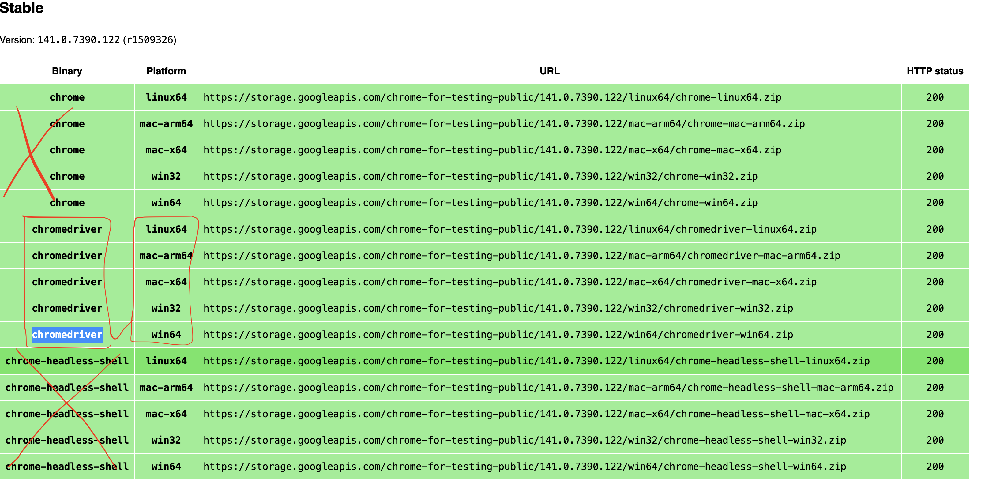

1. Install Java 21
     download open jdk from here - https://openjdk.org/
     download oracle jdk from here - https://www.oracle.com/java/technologies/downloads/

     one installed use below command to know understand where is jdk installed and what is java version.

     '''
         where java
         java -version
     '''

2. Install Maven 3.9
   download maven from here - [https://maven.apache.org/download.cgi](https://maven.apache.org/download.cgi)

  one installed use below command to know understand where is jdk installed and what is java version.

     '''
         where maven
         mvn -version
     '''

3. Install Idea Ultimate
   download IntelliJ from here - [https://maven.apache.org/download.cgi](https://www.jetbrains.com/idea/download/)

4. Download Selenium Web Driver for Chrome
   Link - https://googlechromelabs.github.io/chrome-for-testing/#stable

   PS. Select the "chromedriver" binary for your relevant machine type (ie. mac, linux, win32 or win64)

   4.1 copy the url from the below page and paste it in another tab of the browser to download.
   
   4.2 extract the zip file

   4.3 copy the path of chromedriver.exe and keep it handy

   

6. Start IDEA and Create new project
   - Select Project type as java
   - build tool as maven
   - tick the checkbox to select "create new git repository"
  
  

