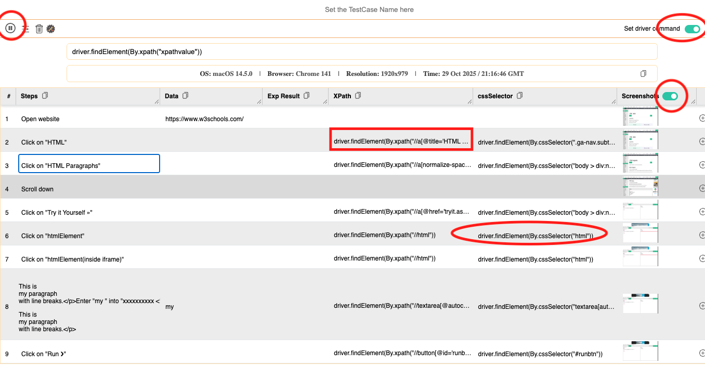

## TestCase Studio - Selenium IDE
#### Selenium IDE is obsolute however there is another chrome extension which we can use for the same 

1. Download Chrome Extention for Selenium Recorder from here - https://chromewebstore.google.com/detail/testcase-studio-selenium/loopjjegnlccnhgfehekecpanpmielcj?hl=en-GB&utm_source=ext_sidebar
2. enable the extension by going to the link  [here](chrome://extensions/)  (only if it is not enabled) 
    
3. Start the chrome extension selecting the extension as per below screenshot (once started it will start recording automatically.)
    
4. Perform your test case manual

5. Go Back to extention window and click Stop Recording

6. here you can now see all the driver commands to select the elements. you need to review them to see if they are correct 
    

